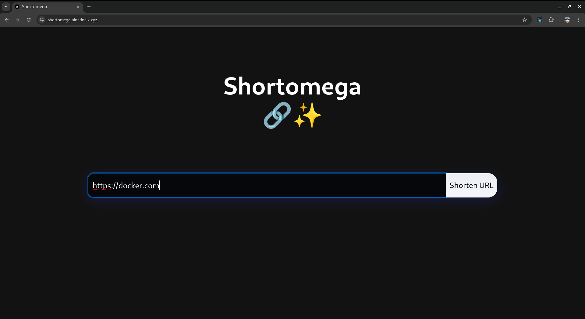
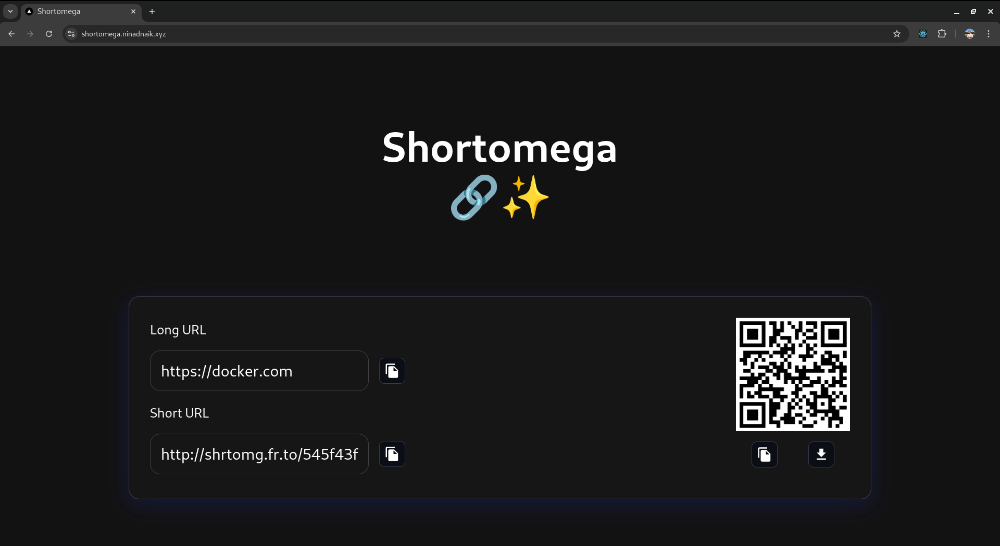
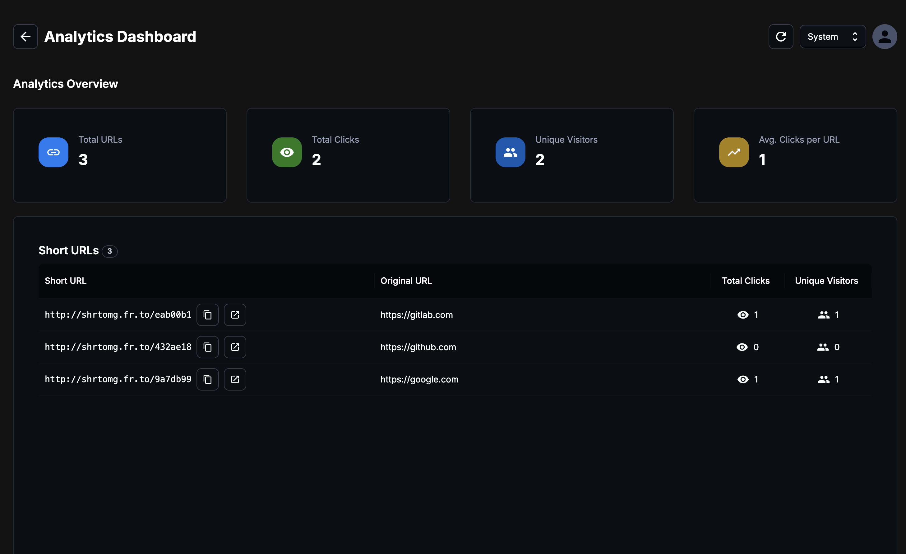

<h1 align="center">Shortomega</h1>

<p align="center">

 

   

</p>

> [!NOTE] 
>The first request to the server may take up to 50 seconds to respond. This delay is due to the free Render instance needing time to spin up from an idle state. Subsequent requests will be much faster.

A simple and modern URL shortener built with Next.js, NestJS, Redis, and Docker. Create shortened URLs instantly with QR code generation and easy sharing capabilities.

The blog describing the motivation and methods that are implemented for using Redis as a primary database: [tech.ninadnaik.me/using-redis-as-a-primary-database](https://tech.ninadnaik.me/using-redis-as-a-primary-database)

## Features

### Current Features

- 🔗 URL Shortening
- 📱 QR Code Generation
- 📋 Copy to Clipboard
- ⬇️ QR Code Download
- 👤 Personal Accounts for URL Tracking
- 📊 Analytics Dashboard
- ⚡ Rate Limiting
- 💨 Response Caching

## Tech Stack

- **Web Client**: Next.js 14 - Server-side rendering and API routes for optimal performance
- **Backend Server**: NestJS - Robust and scalable backend API framework
- **Database**: Redis - High-performance key-value store for URL mappings
- **Containerization**: Docker - Simplified deployment and development environment

## Images





## Prerequisites

- Node.js (v18 or higher)
- Docker and Docker Compose
- Redis (if running locally without Docker)
- Git

## Local Development Setup

### Option 1: Using Docker (Recommended)

1. Clone the repository:

```bash
git clone https://github.com/ninadnaik10/shortomega.git
cd shortomega
```

2. Build and run with Docker Compose:

```bash
docker-compose up --build
```

The application will be available at:

- Web Client: http://localhost:3001
- Backend Server: http://localhost:3000

### Option 2: Manual Setup

1. Clone the repository:

```bash
git clone https://github.com/ninadnaik10/shortomega.git
cd shortomega
```

2. Setup Backend:

```bash
cd api
yarn install
yarn start:dev
```

3. Setup Frontend:

```bash
cd web
yarn install
yarn dev
```

4. Ensure Redis is running locally on default port (6379)

## Environment Variables

### Frontend (.env)

Rename .example.env to .env and set these environment variables:

```
SERVER_URL=http://127.0.0.1:3001
NEXT_PUBLIC_API_URL=http://localhost:3000
NEXT_PUBLIC_SHORT_HOST=http://localhost:3000
NEXT_PUBLIC_SERVER_URL=http://localhost:3001
```

### Backend (.env)

Rename .example.env to .env and set these environment variables:

```
REDIS_HOST=localhost
REDIS_PORT=6379
FRONTEND_URL=http://localhost:3000
JWT_SECRET=<your-jwt-secret-key>
```

## API Endpoints

- `POST /api/shorten` - Create shortened URL
- `GET /api/get-url/:hash` - Retrieve original URL
- `GET /:hash` - Redirect to original URL

## Project Structure

The project follows a monorepo structure with separate web client and API server directories:

```
shortomega/
├── web/           # Next.js frontend application
├── api/           # NestJS backend application
├── docker-compose.yml # Docker composition file
└── .dockerignore      # Docker ignore rules
```

## Development

### Frontend Development

The frontend is built with Next.js and includes:

- Server-side rendering for optimal performance
- API routes for backend communication
- QR code generation and download functionality
- Responsive design with modern UI components

### Backend Development

The backend uses NestJS and includes:

- RESTful API endpoints
- Redis integration for URL storage
- URL validation and processing
- Error handling and logging

## Contributing

1. Fork the repository
2. Create your feature branch (`git checkout -b feature/AmazingFeature`)
3. Commit your changes (`git commit -m 'Add some AmazingFeature'`)
4. Push to the branch (`git push origin feature/AmazingFeature`)
5. Open a Pull Request

## License

This project is licensed under the GNU GPLv3.0 License - see the LICENSE file for details.

## Support

For support, please open an issue in the GitHub repository.
